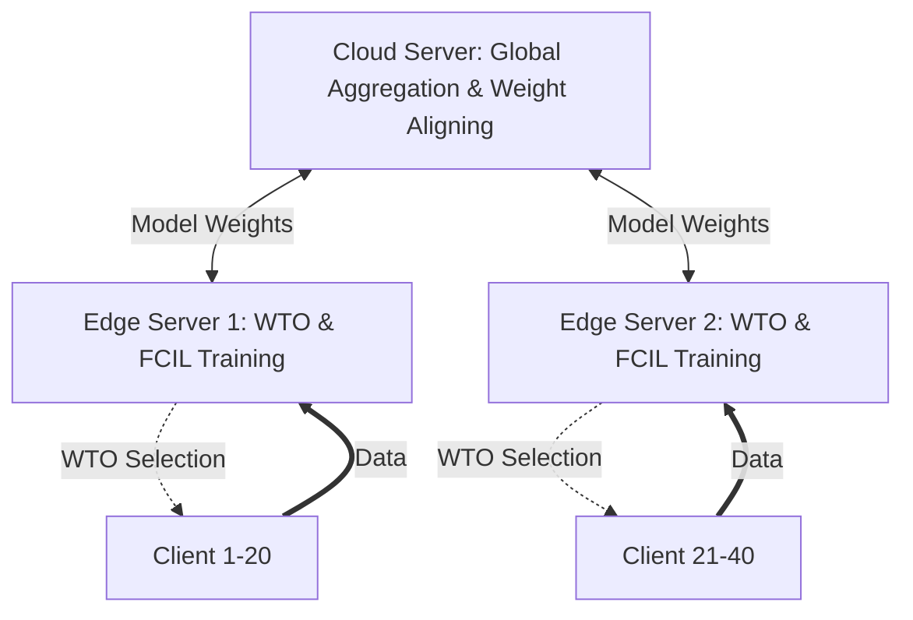

# HFIN: Hierarchical Federated Class-Incremental Learning for NIDS

HFIN (Hierarchical Federated Class-Incremental Learning) là một framework học sâu được thiết kế để giải quyết các thách thức của Hệ thống Phát hiện Xâm nhập Mạng (NIDS) trong môi trường IIoT (Industrial Internet of Things). 

HFIN kết hợp **Federated Learning (Học liên bang)** để huấn luyện mô hình cộng tác bảo mật dữ liệu và **Class-Incremental Learning (Học tăng cường lớp)** để thích ứng với các loại tấn công mới theo thời gian mà không gây hiện tượng "quên lãng thảm họa" (catastrophic forgetting).

---

## 🏛️ Kiến trúc Hệ thống (3-Tier)

Hệ thống được chia thành 3 lớp phân cấp theo bài báo nghiên cứu:

1.  **Cloud Server**: Tổng hợp các mô hình từ Edge Servers bằng phương pháp **FedWeightedAvg** (Eq. 14) và duy trì Global Model. Thực hiện **Weight Aligning (Eq. 9)** để cân bằng trọng số giữa các lớp cũ và mới.
2.  **Edge Server**: Đóng vai trò là trung tâm huấn luyện cục bộ (Local Trainer).
    *   **WTO (Weighted Transmission Optimization)**: Chọn lọc Clients quan trọng nhất để truyền dữ liệu thô (Raw Data) nhằm tối ưu băng thông.
    *   **FCIL Training**: Huấn luyện dựa trên tập dữ liệu gộp từ Clients kết hợp với **Exemplar Memory (500 mẫu)**.
    *   **KD Loss (Eq. 11, 12)**: Sử dụng Softmax-Distillation để duy trì tri thức cũ.
3.  **Client (IIoT Device)**: Các thiết bị có tài nguyên cực yếu. Chỉ chịu trách nhiệm thu thập lưu lượng mạng và gửi dữ liệu thô lên Edge Server khi được chọn qua WTO.



---

## 🚀 Các Tính năng Cốt lõi
*   **Hierarchical FL**: Kiến trúc 3 lớp Cloud-Edge-Client khớp 100% với thực tế IIoT.
*   **WTO (Eq. 8)**: Tối ưu hóa truyền dẫn dựa trên độ quan trọng của lớp và tốc độ truyền dẫn thực thế (Shannon-Hartley).
*   **Adaptive KD Loss (Eq. 7)**: Kết hợp $\mathcal{L}_{CE} + \mathcal{L}_{KD}$ với hệ số Lambdas tự thích ứng theo tỉ lệ lớp mới/cũ.
*   **Herding Memory**: Quản lý bộ nhớ mẫu thông minh tại Edge (m=500).
*   **Weight Aligning (WA)**: Chuẩn hóa classification head sau mỗi task để tránh thiên kiến lớp mới.

---

## 📂 Cấu trúc Dự án
*   `federated/`: Chứa logic `cloud_server.py`, `edge_server.py`, và `client.py`.
*   `incremental/`: Triển khai WTO, Distillation Loss và quản lý bộ nhớ mẫu (Exemplar).
*   `models/`: Kiến trúc **1-D CNN** và Adaptive Classification Head.
*   `data/`: Scripts tiền xử lý và phân chia dữ liệu Non-IID (Dirichlet).
*   `main.py`: Điểm bắt đầu của chu trình huấn luyện toàn diện.
*   `evaluate.py`: Đánh giá chi tiết (Macro-F1, Confusion Matrix, Forgetting Metric).

---

## 🛠️ Cài đặt nhanh
Xem chi tiết tại [GETTING_STARTED.md](./GETTING_STARTED.md).

```bash
pip install -r requirements.txt
python main.py --dataset inf_ton_iot --epochs_global 80
```
